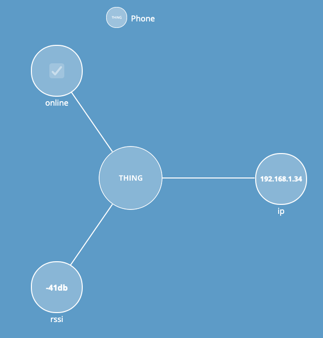

Keenetic Exporter
-----------------

Present devices from your home network as WoT things. You can use this to automate some smart house workflows depending on network status of your portable devices.

Only tested with `Keenetic DSL` router.

